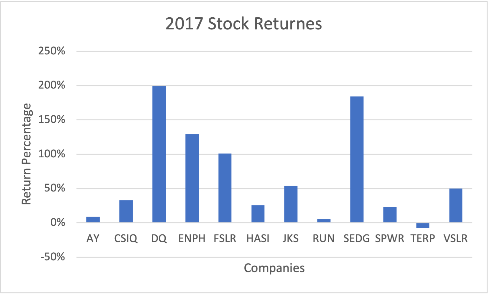
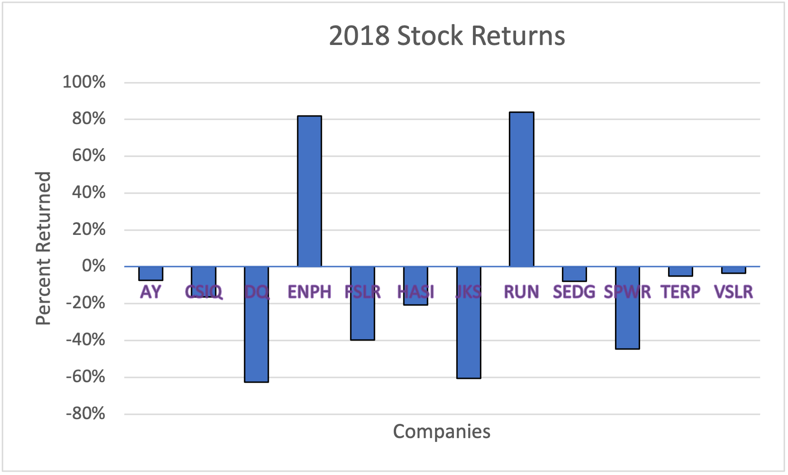

# Green Stocks with VBA

## Overview of Project
In this project we will analyze the stocks of green energy companies and compare how often they were traded between the years 2017 and 2018.
### Purpose 
The purpose of this project is to find whether or not our client should invest in a particular company called Daqo. After analyzing Daqo, we also want to see how Daqo compares to other green companies and whether or not it would be a good investment. 

## Analysis and Challenges
### Analysis of DAQO
When analyzing DAQO for 2017, we can see that its total daily volume is 35,796,200 and its return was 1.99 which is a positive return. However, for 2018 it had a total daily volume of 107,873,900 and a return of -0.62 which is a negative return. In 2018 DAQO's stock grew and was traded over three times as much as in 2017, but it yielded a negative return.

### Analysis of Year 2017
At first glance we can see that all but one company had a positive return, meaning that 2017 was a good year for green stocks in general. The highest stock return was DQ with 199%; while the lowest was TERP with a -7.2% return. The most traded stock was SPWR with 782,187,000 while the least was DQ with a 35,796,200 total daily volume, the stock our client was initially interested in investing.
 

### Analysis of Year 2018
The year 2018 did not go as well for green stocks as 2017, all but two companies had negative returns. The highest return was RUN with 84%, while the lowest was DQ with a -62% return. The most traded stock was ENPH with 607,473,500 while the least was AY with a 83,079,900 total daily volume.     

### Challenges and difficulties Encountered 
The first difficulty I encountered was creating arrays. I did a quick google search and found I needed to use parantheses, but I was still confused on what went inside. I continued with the assignment and then had a problem with how to use 'for loops' and check if the current row is the first or last row in the ticker index. I referred back to my module 2 assignment in the All Stock Analysis macro and was able to follow along with setting up the 'for loop' and 'if' statments. I was able to write the code but kept getting bugs so I attended office hours. The TA helped me understand what exactly was the difference between a variable and an array. He also helped me debug my code so I had the correct range for my for loop and let me know I had too much written for the check first row code.

## Results 
- After comparing all the green stocks for 2017 and 2018 we can see that the stock with the best return was ENPH which was the only one to have a return over 80% and had a total daily volume in the hundreds of thousands both years.
- DQ had the best return in 2017, but the worst in 2018. It was traded by a much larger amount in 2018 than 2017, so investing in DQ may not be a safe investment.

## Summary 
### What are the advantages or disadvantages of refactoring code?

The advantage of refactoring code is that it will run faster than the original script. It will also clean up dirty code- making it easier to read if a peer or even myself need to go back to analyze or make changes. The disadvantages would be that you could introduce a new bug in the code. Refactoring will also take more of your time which you may not have. 

### How do these pros and cons apply to refactoring the original VBA script?

The pros of refactoring our original script is that it forced me to go back and analyze the code, and pushed me to really understand how each part of the code works. Once refactored, I can now see more clearly what the code is doing, and as a code beginner I will be referring back to the old code more often. The con is that there is so much to learn, and I don't have the time to go back and refactor all of my code. 
